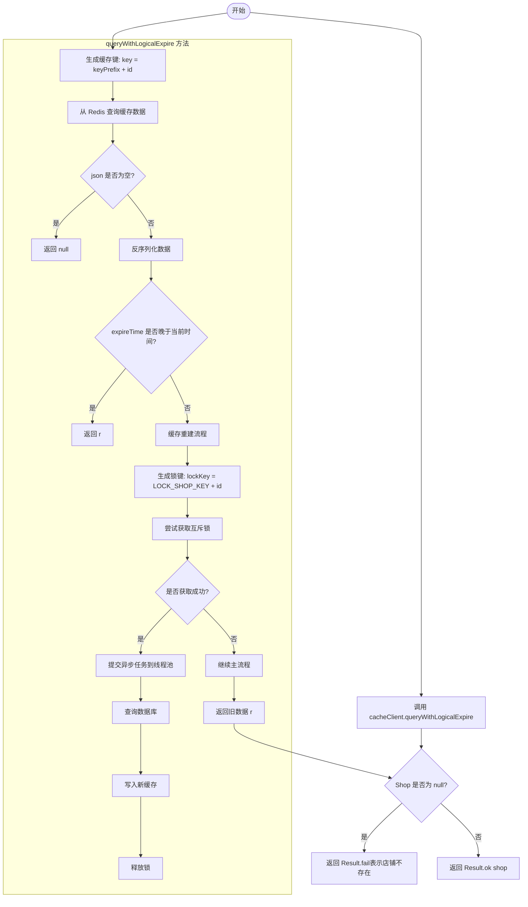
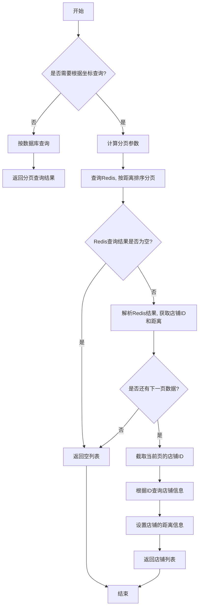

# 1 用户登入

## 1.1 基于session的登入

1. 基于Session登入流程如下，首先验证手机号，通过验证发送验证码，同时将验证码保存在session中，之后进行登入业务时，前端会返回这个session登入业务就取出session中的验证码，同时与前端传来的验证码做对比，如果相同就登入成功，同时将用户信息保存到session中。

   ```java
   // 发送验证码业务中
   session.setAttribute("code", code);
   
   // 登入业务中
   Object cacheCode = session.getAttribute("code");
   ```

2. **由于http是无状态协议，不携带用户信息，服务端无法知道用户的请求对象。**前端的每次请求需要携带用户的信息，然后进行用户认证才可以提供访问该用户敏感信息的权限，每次请求都需要用户进行认证。

   如果每次都是密码校验是不合理，**因此Session会话认证模型解决了这个问题。**服务器存储Session信息（session信息包含了用户个人信息，session模型通过session id唯一标识）在内存中，之后每次请求后端可以根据前端的Session ID得知请求的对象和用户信息。

   ```java
   // 登入业务结束后，将用户信息存入session中，之后的前后端通信都包含了这个session。
   session.setAttribute("user", BeanUtil.copyProperties(user, UserDTO.class));
   ```

3. 在前端通过 HTTP 发起请求时，后端每个接口如果都从 `Session` 中取出用户信息，会导致代码的**耦合度**较高。为了优化这一过程，我们可以在后端的 **拦截器（Interceptor）** 中统一获取用户信息，并将其存储到 `ThreadLocal<UserDTO>` 中。这样每个线程在处理请求的过程中，都可以直接通过 `ThreadLocal` 存储的上下文数据获取当前用户，而不需要多次从 `Session` 或其他地方重复读取。

   - `ThreadLocal` 为每个线程提供独立的存储空间，保证线程安全。
   - 在请求完成后清理 `ThreadLocal` 数据，防止线程复用导致的数据泄漏。
   - 业务逻辑代码通过 `UserHolder` 获取用户信息，解耦了用户信息的获取过程。

   ```java
   public class UserHolder {
       private static final ThreadLocal<UserDTO> tl = new ThreadLocal<>();
       public static void saveUser(UserDTO user){ tl.set(user); }
       public static UserDTO getUser(){ return tl.get(); }
       public static void removeUser(){ tl.remove(); }
   }
   ```


首先用户输入手机号得到验证码，发送手机号和验证码给服务端。服务端核验通过了就生成token返回给前端，前端保存token之后通过token做为身份的验证信息。

## 1.2 集群的session共享问题

**集群的session共享问题：多台Tomcat并不共享session存储空间，当请求切换到不同tomcat服务时导致数据丢失的问题。用户第一次请求发送验证码是第一台tomcat，第二次进行登入的时候请求第二台tomcat，由于第二台tomcat没有第一台的session信息，登入失败。**

**需要实现session的共享！为了解决session的共享，多台tomcat上需要进行session的拷贝，这样会导致存储的冗余，内存空间的浪费；拷贝会有时间间隔导致数据的不一致性。**

**所以redis满足了上述条件，redis可以实现数据共享，基于内存存储速度快，通过key、value结构访问方便。**


## **1.3 Redis实现共享session登入


后端会进行redis交互：用户点击发送验证码时，后端的sendCode需要将手机号和code存入redis中（等待用户收到验证码输入后验证）。用户输入验证码点击登入时，前端传来手机号和code，后端用手机号查询redis中的cachecode。之后cachecode与code进行比对，相同就**生成一个token（UUID）**传给前端，同时保存token和用户信息再redis中。前端访问页面的时候需要**在请求头中携带token**，**后端的拦截器对token进行校验，校验通过刷新token有效期并且**，然后放行。

保存token和用户信息数据结构选择，采用Hash结构。

```java
stringRedisTemplate.opsForHash().putAll(LOGIN_USER_KEY+token, userMap);
// 7.4. 设置token有效期
stringRedisTemplate.expire(LOGIN_USER_KEY+token, LOGIN_USER_TTL, TimeUnit.MINUTES);
// 建议使用lua脚本保证原子性
```

**采用String类型的数据结构无法对当个字段机进行CRUD，并且需要保存字段名，更加占用空间。**

**Hash结构可以对单个字段进行CRUD，并且占用内存更少。**


## 1.4 登入拦截器优化

单个拦截器会拦截页面（这个拦截的规则可以自定义），所以为了优化代码，我们会再定义拦截规则的时候，增加一个刷新token有效期的功能。**但是这个拦截器会存在问题，有一些无需拦截的页面（.excludePathPatterns标识的页面），由于过滤了拦截器不会生效，就不会刷新token的有效期。**

所以为了解决这个问题我们采用双拦截器。order字段标识拦截器的拦截顺序，order(0)先执行，order(1)后执行。

```java
@Configuration
public class MvcConfig implements WebMvcConfigurer {
    @Resource
    private StringRedisTemplate stringRedisTemplate;
    @Override
    public void addInterceptors(InterceptorRegistry registry) {
        // 登录拦截器
        registry.addInterceptor(new LoginInterceptor())
                .excludePathPatterns(
                        "/shop/**",
                        "/voucher/**",
                        "/shop-type/**",
                        "/upload/**",
                        "/blog/hot",
                        "/user/code",
                        "/user/login"
                ).order(1);
        // token刷新的拦截器
        registry.addInterceptor(new RefreshTokenInterceptor(stringRedisTemplate)).addPathPatterns("/**").order(0);
    }
}
```

**第一个拦截器**：定义一个不过滤任何功能的拦截器，这样每次执行某个接口都会调用拦截器，但是这个拦截器不会拦截（最后都会放行），这个拦截器获取token，查询redis用户，保存到threadlocal，刷新token有效期。**全部放行return true，不进行拦截：**

```java
public class RefreshTokenInterceptor implements HandlerInterceptor {
    private StringRedisTemplate stringRedisTemplate;
    public RefreshTokenInterceptor(StringRedisTemplate stringRedisTemplate) {
        this.stringRedisTemplate = stringRedisTemplate;
    }
    @Override
    public boolean preHandle(HttpServletRequest request, HttpServletResponse response, Object handler) throws Exception {
        // 1.获取请求头中的token
        String token = request.getHeader("authorization");
        if (StrUtil.isBlank(token)) { return true;  }
        // 2.基于TOKEN获取redis中的用户
        String key  = LOGIN_USER_KEY + token;
        Map<Object, Object> userMap = stringRedisTemplate.opsForHash().entries(key);
        // 3.判断用户是否存在
        if (userMap.isEmpty()) { return true;}
        // 5.将查询到的hash数据转为UserDTO
        UserDTO userDTO = BeanUtil.fillBeanWithMap(userMap, new UserDTO(), false);
        // 6.存在，保存用户信息到 ThreadLocal
        UserHolder.saveUser(userDTO);
        // 7.刷新token有效期
        stringRedisTemplate.expire(key, LOGIN_USER_TTL, TimeUnit.MINUTES);
        // 8.放行
        return true;
    }
    @Override
    public void afterCompletion(HttpServletRequest request, HttpServletResponse response, Object handler, Exception ex) throws Exception {
        // 移除用户
        UserHolder.removeUser();
    }
}
```

**第二个拦截器**：真正拦截，查询ThreadLocal的用户，用户不存在拦截，存在则继续。

```java
public class LoginInterceptor implements HandlerInterceptor {

    @Override
    public boolean preHandle(HttpServletRequest request, HttpServletResponse response, Object handler) throws Exception {
        // 1.判断是否需要拦截（ThreadLocal中是否有用户）
        if (UserHolder.getUser() == null) {
            // 没有，需要拦截，设置状态码
            response.setStatus(401);
            // 拦截
            return false;
        }
        // 有用户，则放行
        return true;
    }
}
```


# 2 商户服务与缓存

## 2.0 商户服务具体实现

### 2.0.1 具体实现原则

缓存击穿和雪崩的问题只是出现再高并发的场景下，例如做优惠券活动单天，在那一天会有大量的商户查询请求到来，这个时候容易出现缓存击穿和雪崩问题。

在活动到来之前就需要做好一系列准备，例如采用逻辑过期的方法提前将数据导入缓存中。然后活动当天开启redis集群，或者做熔断、降级、限流等操作。

在日常状态下，使用redis缓存只是一个加快用户查询的工具，可以设置正常过期时间。可以保证数据库和缓存的一致性即可（旁路缓存策略）。

### 2.0.2 商户类型查询

在应用的主界面有一个类型栏和对应图标，点击对应类型可以跳转到展示该类型的商户页面。<font color="red">**因为这个商户类型（美食、电影、演出等等）是基本上固定不变而且条数不多。存入redis缓存中是比较合适的，并且可以设置为永不过期。**</font>

```java
public Result queryShopType();
```

### 2.0.3 商户查询

在业务中对于商户的查询存在两种情况：

- **<font color="red">日常查询</font>**：普通情况用户想下单的时候会选择购买。
- **<font color="red">热点Key</font>**：在卖优惠券的活动期间，用户会频繁访问商户信息。

为了提升用户体验，我们引入了redis缓存。提高服务器的响应速度，同时减少Mysql数据库的压力。

引入redis后需要防止两大问题：**一个是缓存击穿、一个是缓存雪崩**。

解决缓存击穿和雪崩方法下面有所介绍。

本项目采用的方法是**逻辑过期和redis集群**。具体为为商户数据设计逻辑过期时间而物理过期时间为永不过期，当需要查询商户数据时候，先解析出逻辑过期时间，与当前时间进行比较，**如果没有过期正常返回**。

如果已经过期了，就开启一个线程更新数据库同时修改缓存，当然为了保证只有一个线程修改缓存（线程安全）修改缓存的时候需要加上分布式锁。



### 2.0.4 逻辑过期存在的问题

**逻辑过期方法核心是将物理过期时间设置为永久这样就不会因为Redis过期淘汰机制导致缓存击穿问题**。但是这样也会带来许多问题，因为这些数据的物理上永不过期，会**占用大量的内存**，初略计算了一些如果APP上又1千万家用户大概需要9个GB来存储数据。这是不能接受的。

可以采用简单的方法，例如活动开始的时候设置永不过期，结束之后恢复日常下的过期时间。

还可以采用**冷热分离+淘汰策略**。

### 2.0.5 更新商户信息

采用旁路缓存策略，先更新数据库后删除缓存。

### 2.0.6 通过类型查询商户

8 章节中附近商铺的功能，用户点击某个商户类型，返回一个下拉的商铺信息给用户，这个商铺信息按照从近到远进行排序推荐给用户。

## 2.1 缓存概念

缓存包括浏览器缓存、应用层缓存和数据库缓存

浏览器缓存用户浏览器上的静态资源，浏览器缓存没有就去应用层（redis中），应用层没有就去数据库缓存（索引在缓存中，查找到了索引再去磁盘里面查数据）。

**缓存优势：降低后端负载、提高读写效率，降低响应时间。**

**缓存成本：数据一致性成本（穿透和击穿），代码的维护成本，运维成本（雪崩）。**


## 2.2 缓存更新策略

**一致性是指数据库更新了内存没有更新**


业务场景：

**低一致性需求：使用内存淘汰机制。例如店铺类型的查询缓存。**

**高一致性需求：主动更新，并以超时剔除作为兜底方案。例如店铺详情查询的缓存**

**主动更新方案：**

### 2.2.1 Cache Aside Pattern（旁路缓存模式）（最常用的）

**1. 读数据的时候**：从cache中读取，读取到了就返回；读取不到就从db中读取放入cache中。


**2. 写数据的时候**：先修改数据库再删除缓存。


- **定义**：缓存由应用程序（调用者）负责管理。在更新数据库时，应用程序会同步更新缓存。

- **优点**：可以精确控制缓存的更新策略。

- **缺点**：缓存与数据库可能出现不一致，应用程序需要额外的代码来保证缓存更新。

- **使用场景**：适合需要高度控制缓存更新的场景，缓存和数据库之间需要同步更新。

  **操作缓存和数据库时有三个问题需要考虑**

  **a、删除缓存还是更新缓存？**

  **（不用）更新缓存：每个更新数据库都更新缓存，无效写操作比较多**

  **（使用）删除缓存：更新数据库时让缓存失效，查询时再更新缓存**

  **b、如何保证缓存与数据库的操作的同时成功或者失败？**

  **单体系统，将缓存与数据库操作放在一个事务。**

  **分布式系统，利用TCC等分布式事务方案。**

  **c、先操作缓存还是先操作数据库？单体系统存在线程安全问题，先写数据库再删缓存方案更优。**

  例如一个线程A需要读取数据，B需要写数据库，正常情况下B写数据库删除缓存，如何A线程读取数据（缓存被删了）库写缓存。存在一个问题，就是缓存出现异常例如TTL变成了-2，A先线程读取数据库（缓存被删了），B开始写数据库，同时删除缓存，A数据库此时写缓存。这个时候出现异常。但是概率非常低，因为写数据库的速度远小于读，所以只可能是A读取完了并且写完了缓存，B才开始写数据库，删除缓存。

**<font color="red">一个值得思考的问题：为什么旁路缓存策略中写操作是“先改数据库，后删缓存”，而不是“先改数据库，后直接set命令修改缓存” ?</font>** 先改数据库后改缓存，这样做读数据的时候就不需要每次都更新缓存？

**<font color="red">当然不行 “先改数据库，后直接set命令修改缓存” ！</font>** 这样会带来几个问题，这些问题是删缓存不会导致的：

1. **并发写导致数据覆盖**：

   设线程A和线程C并发修改同一个商品，数据库最终值为60，但缓存显示80（严重不一致）。

   ```shell
   时间轴 | 线程A（改库存为80）       | 线程C（改库存为60）
   ------------------------------------------------------
     t1  | 更新数据库为80          |
     t2  |                        | 更新数据库为60
     t3  |                        | 更新缓存为60
     t4  | 更新缓存为80           | 
   ```

2. **事务回滚风险**：

   数据库回滚到旧值，但缓存已更新为新值。

   ```java
   @Transactional
   public void updateStock(...) {
       db.update(...); // 数据库操作
       redis.set(...); // 立即更新缓存
       // 若此处抛出异常导致事务回滚
   }
   ```

### 2.2.2 Read/Write Through Pattern（读写穿透模式）

**写（Write Through）**：先查cache，cache中没有直接更新db；cache中有，先更新cache再更新db（同步更新）。


**读（Read Through）**：从cache中读取数据，读取到就返回。读不到先从db中加载，然后写到cache后返回响应。


- **定义**：缓存和数据库通过一个中间服务来整合，所有的读写操作都会先触及缓存，若缓存没有数据，则从数据库加载并写入缓存。
- **优点**：简化了缓存和数据库的操作，用户无需显式管理缓存。
- **缺点**：写操作可能会影响性能，因为每次写入数据库时，也会写入缓存。
- **使用场景**：适合读操作多且数据一致性要求较高的场景。

### 2.2.3 Write Behind Caching Pattern（缓存异步写入模式）

- **定义**：用户写操作只操作缓存，缓存异步地将数据写回数据库，保证最终一致性。
- **优点**：减少了写操作对数据库的压力，提高了性能。
- **缺点**：可能导致缓存与数据库之间短时间不一致，需要保证写回操作的可靠性。
- **使用场景**：适合对数据库写操作频繁的场景，且可以容忍一定的延迟。

## 2.3 Redis雪崩

**Redis雪崩：指同一时段大量的缓存key同时失效或者Redis服务器宕机，导致大量请求到达数据库，带来巨大压力。**

**解决方案：**

- **方法一**：过期时间添加随机值，比如 1-5 分钟随机，这样的话就能保证数据不会在同一个时间大面积失效。

- **方法二**：服务熔断就是当从缓存获取数据发现异常，则直接返回错误数据给前端，防止所有流量打到数据库导致宕机。 

- **方法三**：接口限流，当访问的不是核心数据的时候，在查询的方法上加上接口限流保护。比如设置 10000 req/s。如果访问的是核心数据接口，缓存不存在允许从数据库中查询并设置到缓存中。这样的话，只有部分请求会发送到数据库，减少了压力。

- **方法四**：提前预防，构建高可用Redis 缓存集群，主从：避免单点故障

## 2.4 缓存击穿

**缓存击穿：缓存击穿问题也叫热点Key问题，就是一个被高并发访问并且缓存重建业务比较复杂的key突然失效了，无数的请求访问会瞬间给数据库带来巨大的冲击。**

**常见解决方案互斥锁、逻辑过期。**  


互斥锁保证了各个线程会获得较新的数据，需要循环等待导致性能受到影响，也可能发生死锁。

逻辑过期会开出一个线程进行更新，再未更新完成时，其他线程依旧读取旧数据，涉及一个新字段（expire注意这个不是TTL）


通过setnx实现互斥锁，由于setnx操作会使存在的key他对应的value无法被修改，其他人需要用setnx上锁的时候发现无法被修改，即有人再使用锁则等待，**注意第一个取锁的需要释放锁，同时锁也需要设置有效期避免死锁。**


## 2.5 缓存穿透

缓存穿透是指，由于数据库中id对应的数据为空，导致redis中没有对应的id的数据，导致每次访问这个id的时候都需要查找数据库，导致缓存的穿透，所以redis需要存储id并且令对应的数据为null，使得每次查询的时候redis缓存返回null即可。


## 2.6 业务实现

**给查询商铺的缓存添加超时剔除和主动更新的策略**

修改shopController中的业务逻辑，满足下面的需求:

根据id查询店铺时，如果缓存未命中，则查询数据库，将数据库结果写入缓存，并设置超时时间根据id修改店铺时，先修改数据库，再删除缓存。


# 3 优惠券秒杀

## 3.1 全局ID生成器

全局ID生成器需要满足的特性：

1、唯一性：ID是主键在分布式集群下需要唯一。

2、高可用：ID生成器不能挂了。

3、高性能：ID生成的速度需要足够快。

4、递增性：ID需要整体递增，确保数据库插入的速度。

5、安全性：ID不能让别人猜到。

ID的组成部分:

符号位: 1bit，永远为0

时间戳: 31bit，以秒为单位，可以使用69年

序列号: 32bit，秒内的计数器，支持每秒产生2^32个不同ID，序列号利用了Redis的自增长。


**全局唯一ID生成策略: UUID、Redis自增、snowflake算法（类似于项目中使用的全局ID生成器，维护一个机器ID，对于时钟要求高）、数据库自增、Redis自增ID策略**

一个Snowflake ID有64比特。前41位是时间戳，表示了自选定的时期以来的毫秒数。 接下来的10位代表计算机ID，防止冲突。 其余12位代表每台机器上生成ID的序列号，这允许在同一毫秒内创建多个Snowflake ID。最后以十进制将数字序列化。

## 3.2 超卖问题


常见的解决方案就是加锁。


乐观锁判断查询到的数据是否被修改过，常见的方式有两种：

版本号法：  **在库存减1的时候版本号需要加一**


**CAS法**：上面的版本号法通过添加冗余字段判断字段写回时和读取时是否存在差异，如果有差异说明其他线程修改过了这个时候需要回滚。**CAS法**在**版本号法**的基础上进行改进，由于可以直接**判断需要修改的字段在读取前和修改前是否一致**，就可以判断是否被其他线程修改。

**乐观锁的问题就是成功率太低了。**

乐观锁：不加锁，在更新时判断是否有其他线程在修改。

<font color="red">**乐观锁需要查数据库对于数据库的压力较大**</font>

## 3.3 一人一单


注意一人一单是通过根据userId判断用户是否已经插入了数据，这同样会出现多线程并发问题，先查找，然后判断条件，后插入。**注意无法使用乐观锁，因为乐观锁是针对修改问题的，它可以执行sql的时候判断是否修改了。插入无法这样做所以只能使用悲观锁。**

所以可以根据UserId加锁，如果是同一个userId就加上锁。注意代码实现的时候synchronized (userId.toString().intern())，**不能传入对象，即使两个对象值相同他们并不相等，无法加锁。**

需要先获取锁，提交事务，再释放锁。**集群模式下每个JVM都有对应的锁，所以会出现两个线程都可以获得锁。需要让所有集群公用一把锁。分布式锁。**


**分布式锁：满足分布式系统或集群模式下多进程可见并且互斥的锁。**


# 4 分布式锁


上述的分布式锁还是存在问题，例如线程1第一个执行会获取Redis锁，同时由于业务执行时间过长导致redis锁超时释放了，线程二此时趁虚而入获取了锁执行业务，线程二的业务还未执行完，线程一获取了结束了开始释放Redis锁，由于线程一原先的锁超时释放了，此时线程一释放的是线程二的锁，就出现并行问题。


解决方法：通过添加一个锁标识使得线程一只能释放自己的锁，无法释放别人的锁。

JVM每次创建一个线程就会生成一个ID，不同的JVM线程可能ID会冲突，所以集群的情况下就需要UUID来标识了。


**为什么UUID不会冲突？**

UUID 的设计目标就是在不同的机器、进程，甚至不同时间生成唯一的标识符。UUID 是基于多个因素生成的，具体包括：

1. **时间戳**：UUID 中包含了生成该标识符时的时间戳。这意味着即使在同一台机器上，不同时间生成的 UUID 也能保证唯一性。
2. **机器地址或节点标识符**：UUID 可能会根据机器的网络地址（如 MAC 地址）来生成。这确保了不同机器上的 UUID 在生成时不会发生冲突。
3. **随机数或伪随机数**：部分 UUID 生成方式会使用随机数或伪随机数来进一步增加唯一性。这样即使两个 UUID 生成的机器相同，时间相同，它们依然可能通过随机数部分保证唯一。
4. **算法保证**：UUID 的版本（例如 UUIDv1, UUIDv4）通过定义特定的算法，进一步增强了它的唯一性。UUIDv1 结合了时间戳、机器地址、进程 ID，而 UUIDv4 完全基于随机数生成，理论上可以生成足够多的唯一值。

因此，UUID 是通过这些因素的组合来保证在理论上极低的概率发生冲突，尤其是在大规模集群或分布式环境中。即使机器在不同的网络环境中运行，也能保证其生成的 UUID 唯一。

**我们在构造函数中定义了UUID，这个UUID生成后仅仅会生成一次一次**

**如果UUID是在类的构造函数或某个初始化方法中生成并赋值给成员变量的，并且只生成一次，那么这个UUID在类的实例生命周期内是保持不变的，无论进行多少次查询操作都不会改变。**

在上述的改进Redis分布式锁中，由于判断锁是否属于自己和释放锁是两条语句，所以有可能会出现，线程一判断是自己的锁通过了，然后执行释放锁之前线程阻塞了。如果此时锁超时了，线程二开始拿到锁，然后执行。此时线程一开始恢复运行，由于他通过了锁的判断，所以直接执行释放锁，这就导致了线程二的锁被释放了。

**所以要确保锁的判断和释放要具备原子性。**

redis提供了lua脚本实现redis命令的组合的原子性。

## 秒杀下单业务


## Redisson引入原因

Redis基于setnx实现的分布式锁存在下面的问题：

- 不可重入：同一个线程无法多次获取同一把锁。
- 不可重试：获取锁只尝试一次就返回false，没有重试机制。
- 超时释放：锁超时释放虽然可以避免死锁，但如果是业务执行耗时较长，也会导致锁释放，存在安全隐患。
- 主从一致性：由于 Redis 主从同步的延迟，当你使用主从架构的 Redis 实现分布式锁时，可能会出现 **从节点数据不一致** 的情况。如果主节点故障，从节点升级为主节点时，锁信息可能未同步完成，导致锁的实现出现问题。

Redisson是一个在Redis的基础上实现的lava驻内存数据网格 (In-Memory Data Grid)。它不仅提供了一系列的分布式的Java常用对象，还提供了许多分布式服务，其中就包含了各种分布式锁的实现。

```shell
<dependency>
    <groupId>org.redisson</groupId>
    <artifactId>redisson</artifactId>
    <version>3.13.6</version>
</dependency>
```

redisson客户端配置，红锁

```java
@Configuration
public class RedissonConfig {
    @Bean
    public RedissonClient redissonClient() {
        // 配置
        Config config = new Config();
        config.useSingleServer().setAddress("redis://192.168.10.102:6379").setPassword("123321");
        // 创建RedissonClient对象
        return Redisson.create(config);
    }
    @Bean
    public RedissonClient redissonClient2() {
        // 配置
        Config config = new Config();
        config.useSingleServer().setAddress("redis://192.168.10.102:6381").setPassword("123321");
        // 创建RedissonClient对象
        return Redisson.create(config);
    }
    @Bean
    public RedissonClient redissonClient3() {
        // 配置
        Config config = new Config();
        config.useSingleServer().setAddress("redis://192.168.10.102:6382").setPassword("123321");
        // 创建RedissonClient对象
        return Redisson.create(config);
    }
}
```

Redisson创建锁


## Redisson可重入锁原理

引入可重入锁引入是解决单一线程多次获取锁，例如递归调用。


### 获取锁

```shell
---
--- Generated by EmmyLua(https://github.com/EmmyLua)
--- Created by 16404.
--- DateTime: 2024/12/7 15:12
---
-- 可重入锁
local key = KEYS[1]; -- 锁的key
local threadId = ARGV[1]; -- 线程唯一标识
local releaseTime = ARGV[2]; -- 锁的自动释放时间
-- 判断是否存在
if (redis.call('exists', key) == 0) then
    -- 不存在，获取锁
    redis.call('hset', key, threadId, '1');
    -- 设置有效期
    redis.call('expire', key, releaseTime);
    return 1; -- 返回结果
end;
-- 锁已经存在，判断threadId是否是自己
if (redis.call('hexists', key, threadId) == 1) then
    -- 不存在，获取锁，重入次数+1
    redis.call('hincrby', key, threadId, '1');
    -- 设置有效期
    redis.call('expire', key, releaseTime);
    return 1; -- 返回结果
end;
return 0; -- 代码走到这里，说明获取锁的不是自己，获取失败
```

### 释放锁

```shell
-- 可重入锁
local key = KEYS[1]; -- 锁的key
local threadId = ARGV[1]; -- 线程唯一标识
local releaseTime = ARGV[2]; -- 锁的自动释放时间
if (redis.call('HEXISTS', key, threadId) == 0) then
    return nil; -- 如果已经不是自己，则直接返回
end;
-- 是自己的锁，则重入次数-1
local count = redis.call('HINCRBY', key, threadId, -1);
-- 判断是否重入次数是否已经为0
if (count > 0) then
    -- 大于0说明不能释放锁，重置有效期然后返回
    redis.call('EXPIRE', key, releaseTime);
    return nil;
else -- 等于0则说明可以释放锁
    redis.call('DEL', key);
    return nil;
end ;
```

## Redisson分布式锁


**Redisson分布式锁原理：**

**可重入：利用hash结构记录线程id和重入次数**

**可重试：利用信号量和PubSub功能实现等待、唤醒、获取锁失败的重试机制。**

**超时续约：利用watchDog，每隔一段时间（releaseTime/3），重置超时时间。**

问题1、redis互斥锁。下面代码存在的问题下面代码不具备原子性。(为什么要加过期时间：**因为如果执行业务逻辑的时候Redis宕机了，未能执行delete操作，这个时候需要锁就永远留在了redis中**)

```java
Boolean reuslt = stringRedisTemplate.opsForValue().setIfAbsent(lockKey, "zjx");
stringRedisTemplate.expire(lockKey, 10, TimeUnit.SECONDS);

// TODO 业务逻辑

stringRedisTemplate.delete(lockKey);
```

问题2、用一行代码实现或者lua脚本，**平时写代码的时候不能犯错**。

```java
Boolean reuslt = stringRedisTemplate.opsForValue().setIfAbsent(lockKey, "zjx", 10L, TimeUnit.SECONDS);

// TODO 业务逻辑

stringRedisTemplate.delete(lockKey);
```

**所以问题出现了，如果A线程执行业务的过程中延迟时间结束了，锁自动释放了。此时B线程获取锁，执行业务。此时A的业务执行完了delete锁，此时删除了B业务的锁。**

问题的根源在于删错了锁。

问题3、解决方案给每个线程添加UUID。

```java
String clientId = UUID.randomUUID().toString();
Boolean reuslt = stringRedisTemplate.opsForValue().setIfAbsent(lockKey, "zjx", 10L, TimeUnit.SECONDS);
try {
    // TODO 业务逻辑
} finally {
    if (clientId.equals(stringRedisTemplate.opsForValue().get(lockKey))) {
        stringRedisTemplate.delete(lockKey);
    }
}
```

问题4、还有问题：finally中if语句中的判断和删除语句不具备原子性，可能条件判断通过了，由于CPU抢占，导致KEY过期了，此时依旧会出现删除其他线程的锁的情况，类似问题3。可以通过将下面两行语句通过lua脚本实现。

```java
if (clientId.equals(stringRedisTemplate.opsForValue().get(lockKey))) {
        stringRedisTemplate.delete(lockKey);
    }
```

最佳解法：上面实际上还存在很多问题，例如延迟时间的续期。**可以用Redisson。**


## Redisson的multiLock

1) 不可重入Redis分布式锁:

   ◆原理:利用setnx的互斥性;利用ex避免死锁;释放锁时判断线程标示

   ◆ 缺陷:不可重入、无法重试、锁超时失效

2) 可重入的Redis分布式锁:

   ◆原理:利用hash结构，记录线程标示和重入次数:利用watchDog延续锁时间;利用信号量控制锁重试等待

   ◆缺陷:redis宕机引起锁失效问题

3) Redisson的multiLock:

   ◆原理:多个独立的Redis节点，必须在所有节点都获取重入锁，才算获取锁成功

   ◆缺陷:运维成本高、实现复杂

## Redis优化秒杀业务


秒杀业务的优化思路是什么？

①利用redis完成库存余量、一天一单判断，完成抢单业务

②再将下单业务放入阻塞队列，利用独立线程异步下单

**基于阻塞队列的异步秒杀存在哪些问题？**

**内存限制，如果服务器创建了过多的任务放入阻塞队列中，JVM的内存会溢出**

**数据安全问题，1、任务（订单）是放在阻塞队列里面的，即在内存中，如果服务器宕机了，内存中的数据丢失了。2、任务出错了，订单丢失了。**

**redis不依赖于JVM内存，不担心JVM存储上限的问题。reids可以持久化数据在磁盘中。**

**redis缺点：无法避免消息丢失，只支持单消费者。**

# 5. Redis消息队列

## 5.1 基于PubSub的消息队列

Pubsub(发布订阅)是Redis2.0版本引入的消息传递模型。顾名思义，**消费者可以订阅一个或多个channel**，生产者向对应channel发送消息后，所有订阅者都能收到相关消息。

- SUBSCRIBE channel[channel] : 订阅个或多个频道

- PUBLISH channel msg : 向一个频道发送消息

- PSUBSCRIBE pattern[pattern]: 订阅与pattern格式匹配的所有频道


基于PubSub的消息队列有哪些优缺点?

**优点:**

- 采用发布订阅模型，支持多生产、多消费

**缺点:**

- 不支持数据持久化

- 无法避免消息丢失

- 消息堆积有上限，超出时数据丢失

## 5.2. Stream的消息队列

### 5.2.1. 单消费者模式


**redis中消息读取后可以重复读取，想要读取最新消息要利用 $ 符号。**


当我们指定起始ID为 $ 时，代表读取最新的消息，**如果我们处理一条消息的过程中，又有超过1条以上的消息到达队列**，则下次获取时也只能获取到最新的一条，会出现漏读消息的问题。

**STREAM类型消息队列的XREAD命令特点:**

- 消息可回溯

- 一个消息可以被多个消费者读取

- 可以阻塞读取

- 有消息漏读的风险

### 5.2.2. 消费者组


**STREAM类型消息队列的XREADGROUP命令特点**

- 消息可回溯

- 可以多消费者争抢消息，加快消费速度

- 可以阻塞读取

- 没有消息漏读的风险

- 有消息确认机制，保证消息至少被消费一次


### 5.2.3. 基于Redis的Stream结构作为消息队列，实现异步秒杀下单


# 6. 达人探店

## 6.1. 发布探店笔记


## 6.2. 点赞

需求:

- 同一个用户只能点赞一次，再次点击则取消点赞

- 如果当前用户已经点赞，则点赞按钮高亮显示(前端已实现，判断字段Blog类的isLike属性)

实现步骤:

- 给Blog类中添加一个isLike字段，标示是否被当前用户点赞
- 修改点赞功能，利用Redis的set集合判断是否点赞过，未点赞过则点赞数+1，已点赞过则点赞数-1
- 修改根据id查询Blog的业务，判断当前登录用户是否点赞过，赋值给isLike字段
- 修改分页查询Blog业务，判断当前登录用户是否点赞过，赋值给isLike字段

## 6.3 点赞排行榜


使用**SortedSet数据**结构存储点赞信息。

通过zadd插入元素，**ZADD Key key1 score1 key2 score2**。

插入的元素中key1是用户的id，score1是点赞的时间戳。

查询top5的点赞用户 **zrange key 0 4**。

注意数据库的小问题，zrange给的数据是对的，但是数据库查出来的却不是，所以需要用数据库的order by filed方法。

```java
@Override
public Result queryBlogLikes(Long id) {
    String key = BLOG_LIKED_KEY + id;
    // 1. 查询top5的点赞用户 zrange key 0 4
    Set<String> top5 = stringRedisTemplate.opsForZSet().range(key, 0, 4);
    if (top5 == null || top5.isEmpty()) {
        return Result.ok(Collections.emptyList());
    }
    // 2. 解析出其中的用户id
    List<Long> ids = top5.stream().map(Long::valueOf).collect(Collectors.toList());
    String idStr = StrUtil.join(",", ids);
    // 3. 根据用户id查询用户 where id in (ids) order by filed(id, ids)
    List<UserDTO> userDTOS = userService.query()
        .in("id", ids).last("order by field(id,"+idStr+")")
        .list()
        .stream()
        .map(user -> BeanUtil.copyProperties(user, UserDTO.class))
        .collect(Collectors.toList());
    // 4. 返回
    return Result.ok(userDTOS);
```

# 7. 好友关注

## 7.1 关注和取关


## 7.2 共同关注


## 7.3 Feed流实现方案

关注推送也叫做Feed流，直译为**投喂**。为用户持续的提供“沉浸式”的体验，通过无限下拉刷新获取新的信息。

Feed流产品有两种常见模式:

- Timeline: 不做内容筛选，简单的按照内容发布时间排序，常用于好友或关注。例如朋友圈。

  - 优点:信息全面，不会有缺失。并且实现也相对简单

  - 缺点:信息噪音较多，用户不一定感兴趣，内容获取效率低

- 智能排序: 利用智能算法屏蔽掉违规的、用户不感兴趣的内容。推送用户感兴趣信息来吸引用户

  - 优点: 投喂用户感兴趣信息，用户粘度很高，容易沉迷

  - 缺点:如果算法不精准，可能起到反作用。

**使用Timeline模式实现投喂偶像的笔记给粉丝。**

### 7.3.1 拉模式：也叫做读扩散

张三和李四发了笔记存入发件箱中，赵六关注了他们两。当赵六需要读取的时候，收件箱拉张三和李四发件箱里面的笔记，然后进行排序给赵六读取。

**赵六的收件箱一般都是空的只有读取的时候才会拉取**。每次都要拉取耗时高。空间占用低。


### 7.3.2 推模式：也叫做写扩散

用户没有发件箱，当用户发笔记的时候会把笔记推给所有粉丝。不用临时拉取，延时低。空间占用高，要保存冗余数据。


### 7.3.3 推拉结合模式：也叫做读写混合

兼具推和拉两种模式的优点。对于大V来说，活跃粉丝利用推模式，普通粉丝利用拉模式。


## 7.4 推送到粉丝邮箱

需求：

- 修改新增探店笔记的业务，在保存blog到数据库的同时，推送到粉丝的收件箱（**由于保存了blog所以只需要推送笔记id到redis收件箱中即可**）。

- 收件箱满足可以根据时间戳排序，必须用Redis的数据结构实现。

- 查询收件箱数据时，可以实现分页查询。


这里采用SortedSet数据结构作为收件箱，Key是用户id，key1是博客id，score是博客创建的时间戳。

代码中使用opsForZSet().add()实现数据的添加。

## 7.5 滚动分页查询收件箱

传统的分页查询是根据角标进行查询，这个查询方法当数据库插入一条数据脚本发生了变化，按照角标进行分页的方法自然就出现了错误。

所以可以选择按照时间戳采用zrevrangebysore进行查询。

```shell
ZREVRANGEBYSCORE key max min [WITHSCORES] [LIMIT offset count]
```

查询SortedSet（从大到小排序：用了ZREVRANGEBYSCORE）中score小于等于max，大于等于min的元素集合，按照从大到小进行排序[0, ..., n]。offset是偏移量，count是查询的个数。所以返回的结果是下标 [offset, offset+count]的元素。

## 7.6 实现滚动分页查询


# 8. 附近商铺

## 8.1 GEO数据结构基本用法


```shell
1. GEOADD g1 116.378248 39.865275 bjn 116.42803 39.903738 bjz 116.322287 39.893729 bjx
2. GEODIST g1 bjx bjz // 默认单位是米
3. GEOSEARCH g1 FROMLONLAT 116.397904 39.909005 BYRADIUS 10 km WITHDIST
```

## 8.2 导入店铺数据到GEO


## 8.3 实现附近商户功能

实现按照商铺类型查询商铺，输入参数包括（类型，当前页，用户纬度，用户经度）

1、判断是否需要根据经纬度查询。不需要直接查询数据库。

2、否则利用redis中的GEO数据结构，计算分页参数。

3、查询redis、按照距离排序、分页。返回shopId和distance。

GEOSEARCH BYLONLAT x y byradius 10 withdistance

4、解析出Id。

5、根据id查询shop。



```java
@Override
public Result queryShopByType(Integer typeId, Integer current, Double x, Double y) {
    // 1. 是否需要根据坐标查询
    if (x == null || y == null) {
        // 不需要坐标查询，按数据库查询
        Page<Shop> page = query()
                .eq("type_id", typeId)
                .page(new Page<>(current, SystemConstants.DEFAULT_PAGE_SIZE));
        // 返回数据
    }
    // 2. 计算分页参数
    int from = (current - 1) * SystemConstants.DEFAULT_PAGE_SIZE;
    int end = current * SystemConstants.DEFAULT_PAGE_SIZE;
    // 3. 查询redis，按照距离排序、分页。结果：shopId，distance
    // geosearch bylonlat x y byradius 10 withdistance
    String key = SHOP_GEO_KEY + typeId;
    GeoResults<RedisGeoCommands.GeoLocation<String>> results = stringRedisTemplate.opsForGeo().search(
            key,
            GeoReference.fromCoordinate(x, y),
            new Distance(5000),
            RedisGeoCommands.GeoSearchCommandArgs.newGeoSearchArgs().includeDistance().limit(end));
    // 4. 解析出id
    if (results == null) {
        return Result.ok(Collections.emptyList());
    }
    List<GeoResult<RedisGeoCommands.GeoLocation<String>>> content = results.getContent();
    if (content.size() <= from)
        // 没有下一页了结束。
        return Result.ok(Collections.emptyList());
    // 4.1. 截取 from 到 end 部分
    ArrayList<Long> ids = new ArrayList<>(content.size());
    Map<String, Distance> distanceMap = new HashMap<>(content.size());
    content.stream().skip(from).forEach(result->{
        // 4.2. 获取店铺id
        String shopIdStr = result.getContent().getName();
        ids.add(Long.valueOf(shopIdStr));
        // 4.3. 获取距离
        Distance distance = result.getDistance();
        distanceMap.put(shopIdStr, distance);
    });
    // 5. 根据id查询shop
    String idStr = StrUtil.join(",", ids);
    List<Shop> shops = query().in("id", ids).last("Order by field (id, " + idStr + ")").list();
    for (Shop shop : shops) {
        shop.setDistance(distanceMap.get(shop.getId().toString()).getValue());
    }
    // 6. 返回
    // 根据类型分页查询
    return Result.ok(shops);
}
```

# 9 用户签到

## 9.1 BitMap功能演示

假如我们用一张表来存储用户签到信息，其结构应该如下：


假如有1000万用户，平均每人每年签到次数为10次，则这张表一年的数据量为 1亿条。

每签到一次需要使用（8 + 8 + 1 + 1 + 3 + 1）共22字节的内存个月则最多需要600多字节。

**为了解决存储空间占用过大的问题，使用BitMap来存储签到信息**。我们按月来统计用户签到信息，签到记录为1，未签到则记录为0。

把每一个bit位对应当月的每一天，形成了映射关系。用0和1标示业务状态，这种思路就称为位图 (BitMap)。

Redis中是利用string类型数据结构实现BitMap，因此最大上限是512M，转换为bit则是2^32个bit位。


setbit key offset 1/0

## 9.2 实现签到功能


```java
public Result sign() {
    // 1. 获取当前登入用户
    Long userId = UserHolder.getUser().getId();
    // 2. 获取日期
    LocalDateTime now = LocalDateTime.now();
    // 3. 拼接key
    String keySuffix = now.format(DateTimeFormatter.ofPattern(":yyyyMM"));
    String key = USER_SIGN_KEY + userId + keySuffix;
    // 4. 获取今天是本月的第几天
    int dayOfMonth = now.getDayOfMonth();
    // 5. 写入Redis SETBIT key offset 1
    stringRedisTemplate.opsForValue().setBit(key, dayOfMonth-1, true);
    return Result.ok();
}
```

## 9.3 统计连续签到

问题1:什么叫做连续签到天数?

从最后一次签到开始**向前**统计，直到遇到**第一次**未签到为止，计算总的签到次数，就是连续签到天数。

问题2:如何得到本月到今天为止的所有签到数据?

**BITFIELD key GET u[dayOfMonth] 0**

问题3:如何从后向前遍历每个bit位?

与1做与运算，就能得到最后一个bit位。

随后右移1位，下一个bit位就成为了最后一个bit位。


```java
List<Long> result = stringRedisTemplate.opsForValue().bitField(
        key, BitFieldSubCommands.create()
    			.get(BitFieldSubCommands.BitFieldType.unsigned(dayOfMonth))
                .valueAt(0)
);
```

# 10. UV统计

## 10.1 HyperLogLog的用法

HyperLogLog用法

首先我们搞懂两个概念:

UV:全称Unique Visitor，也叫**独立访客量**，是指通过互联网访问、浏览这个网页的自然人。**1天内同一个用户多次访问该网站，只记录1次**。

PV:全称Page View，也叫**页面访问量或点击量**，用户每访问网站的一个页面，记录1次PV，**用户多次打开页面**，则记录多次PV。**往往用来衡量网站的流量**。

UV统计在服务端做会比较麻烦，因为要判断该用户是否已经统计过了，需要将统计过的用户信息保存。但是如果每个访问的用户都保存到Redis中，**数据量会非常恐怖**。


## 10.2 测试百万数据的统计

# 11. redis数据结构

## 11.1 redis 的整体结构

redis 的本质就是一个键值对数据库。key是字符串对象，value可以是任意的redis数据结构（List、Hash、Set、Zset等）。


上图就是redis数据库结构，本质就是利用了hash数据结构，两张hash表用于哈希扩容，dictEntry里面存放的就是key和value指针，key指向String对象，value指向redis任意数据结构。<font color="red">**注意：key和value都是Redis对象，每个对象都由redisObject结构表示**</font>。下图是redisObject的数据结构：

- **type**用于标识对象属于**声明类型**（String对象、List对象、Hash对象、Set对象和Zset对象）。
- **encoding**标识该对象使用了什么**数据结构**
- **ptr**则是指向底层数据结构的**指针**（**如果编码是int，ptr中存放的是long类型的值**）。


## 11.2 SDS简单动态字符串

SDS数据结构包括

- uint len：记录字符串长度
- uint alloc：分配的空间长度
- unsigned char flags：sds的类型（sdshdr5，sdshdr8，sdshdr16，sdshdr32，sdshdr64）
- char buf[]：字节数组。

不同flag的区别在于len和alloc字段，sdshdr16中len和alloc类型为uint16_t，sdshdr32中则是uint32_t。

在编译上也进行了优化，struct声明了`__attribute__((packed))`，作用就是告诉编译器在编译过程中取消结构体的优化对齐，按照实际占用字节数进行对齐。

SDS支持动态扩容，当字符串长度超过了alloc分配的长度之后进行扩容，如果长度小于等于MB，每次翻倍。超过1MB每次就加1MB。

## 11.3 链表

### 11.3.1 压缩列表

压缩列表是Redis为了节约内存开发的，由连续的内存块组成的顺序型数据结构。如下图。


- zlbytes是记录压缩链表总字节数。

- zltail记录尾节点偏移量。

- zllen记录节点的个数。

- zlend是为结尾标志。

- entry节点由三部分组成，prevlen前一个节点的长度，encoding记录当前节点的类型和当且节点长度，data是数据。

压缩列表有**连锁更新**问题，就是某个节点的长度变化了，可能会后一个节点的prevlen字段长度会发生变化，例如某个字节点长度从128字节变成了1MB，下一个节点的prevlen会从1B变成5B。如果后续节点也同理会发生变化

### 11.3.2 QuickList 快表

快表的是一个以**压缩列表为节点的双向链表**，数据结构为 quicklist，quicklist 中包含了链表的头节点、尾节点、总元素个数和节点个数（压缩列表数量）。
quicklistnode 结构体中包含了前一个节点 quicklistnode、后一个节点 quicklistnode、指向压缩列表的指针。

quicklist 会控制 quicklistNode 结构里的压缩列表的大小或者元素个数，缓解连锁更新问题。

### 11.3.3 ListPack 紧凑列表

为了解决连锁更新问题，新版本的redis提出了（还未使用）listpack数据结构。不同于压缩列表，压缩列表使用了prelen记录上一个节点的长度、encoding记录编码和长度、data保存数据。**导致连锁更新的罪魁祸首是prelen，listpack取消了prelen，entry节点由encoding（单纯记录编码）、len（记录编码和data的长度）和data。**


## 11.4 哈希表

解决哈希冲突的方法有很多例如拉链法、开放寻址发、再哈希。redis和java的hashmap使用的都是拉链法，区别在于hashmap使用链表转红黑树，redis就是简单的链表。

**redis使用渐进rehash，当超过负载因子的时候会扩大一倍**。

**rehash触发条件，当负载因子大于等于1的时并且没有执行RDB快照和AOF重写时就会rehash。当负载因子大于等于5时，强制rehash。负载因子=元素个数/hash表容量。**

渐进式 rehash 步骤如下：

- 给「哈希表 2」 分配空间；
- **在 rehash 进行期间，每次哈希表元素进行新增、删除、查找或者更新操作时，Redis 除了会执行对应的操作之外，还会顺序将「哈希表 1 」中索引位置上的所有 key-value 迁移到「哈希表 2」 上；**
- 随着处理客户端发起的哈希表操作请求数量越多，最终在某个时间点会把「哈希表 1」的所有 key-value 迁移到「哈希表 2」，从而完成rehash 操作。

## 11.5 整数集合

整数集合使用的数据结构包括**长度、编码、数组**。其中长度记录元素个数，**编码记录数组类型（8b、16b、32b和64b）**。整数集合支持升级，就是如果数组中存储的都是8b的整数，突然来了一个16b的，此时就会触发升级，数组的类型变成int16。**他这个扩容是在原来的数组上扩充，不会改变数组的起始位置**。**整数集合不支持降级。**

```c
typedef struct intset {
    // 编码方式
    uint32_t encoding;
    // 集合包含的元素数量
    uint32_t length;
    // 保存元素的数组
    int8_t contents[];
} inset;
```

## 11.6 ZSET（哈希表+跳表）

redis有个zset数据结构，他支持高效的单点查询也支持范围查询。所以zset维护两个数据结构，一个哈希表用于单点查询，同时维护跳表实现范围查询。

跳表原理如下：**跳表zskiplist是一个多层的链表**，在zskiplist结构体中包含了跳表的头节点和尾节点类型均为zskiplistnode，还包含了长度length和跳表最大层级level。

zskiplistnode是跳表节点的结构体，包含了元素（sds类型的ele）、分数score（排序准则）、backward指向前一个节点的指针和zskiplistlevel数组（因为一个节点存在多个层级，每个层级zskiplistlevel节点都有一个指针指向下一个层级大于等于当前层级的节点）。

zskiplistlevel结构体包含了zskiplistnode类型的forward指针和无符号long类型的span指针。

跳表依据score查找元素是通过forward指针查找。如果需要依据相对位置呢（例如查找第5大的元素），这个时候需要使用span，**span记录了当前节点与forward的指针指向的节点相差了多少个节点。**

**节点的层级是如何确定的？**当生成一个节点时会先确定层级，首先是一层，然后不断生成随机数，如果随机数小于等于0.25就加一层，如果大于0.25就停止，确定高度。最大高度是64。

**为什么用跳表不用平衡树？**

1. 内存优势，内存占用上平衡树需要使用2个指针指向左子树和右子树。跳表的指针数量取决于节点的层级，一层需要一个指针，假设每添加一层的概率是p，那么指针的数量就是1/(1-p)。

2. 跳表的增删改查实现比平衡树简单，代码的可维护性高。

# 12. Redis持久化

## 12.1 AOF持久化

### 12.1.1 AOF持久化流程

redis持久化，采用AOF持久化，具体而言使用redis启动（修改配置文件）持久化后会将所有写操作写入一个文件中。重启redis时会通过读取这个文件执行里面的操作恢复缓存。


redis持久化流程：

- 用户输入命令，redis执行命令**成功执行后**，
- 将这条命令写入**AOF缓冲区**中。
- 通过三种**写回策略**将缓冲区中的数据**写回磁盘**。

这个持久化存在两个问题：

1. AOF缓冲区中的数据未及时写回磁盘可能导致数据丢失。
2. redis是单线程的，写回磁盘和执行命令是串行同步执行，所以写磁盘会导致下一条指令的阻塞。

redis如何通过将缓冲中的数据写回硬盘？

1. 首先会使用write()系统调用**将用户缓冲区中的数据拷贝到内核缓冲区**中，
2. 最后操作系统使用**fsync()函数将内核缓冲区中的数据写回磁盘**。


三种写回磁盘中的策略，本质上是用户操控fsync()函数。

1. always：每次写操作命令执行完后，立即调用fsync同步将 AOF 日志数据写回硬盘。

2. Everysec：每隔一秒就调用fsync将内核缓冲区里的内容写回到硬盘。

3. No：用户不使用fsync，由操作系统决定何时将内核缓冲区内容写回硬盘。


### 12.1.2 AOF重写机制

通过上面介绍可以看出，**aof日志会随着redis的写操作变得越来越大**。里面也包含了各种被覆盖的操作。所以redis提供了aof重写机制。

**尽管某个键值对被多条写命令反复修改，最终也只需要根据这个「键值对」当前的最新状态**，然后用一条命令去记录键值对，代替之前记录这个键值对的多条命令，这样就减少了 AOF 文件中的命令数量。最后在重写工作完成后，将新的 AOF 文件覆盖现有的 AOF 文件。

如果重写失败就会造成aof文件污染，出现污染后会重新执行重写。

redis重新AOF是通过**bgrewriteaof后台子进程**来实现。子线程和子进程的区别在于，同一个进程共用一个虚拟地址（虚页表）；**不同的进程用两块不同的虚页表**，但是物理页表却是可能相同也可能不同。**redis主进程和bgrewriteaof子进程，使用相同的物理内存。**


**在发生写操作的时候，操作系统才会去复制物理内存**，这样是为了防止 fork 创建子进程时，由于物理内存数据的复制时间过长而导致父进程长时间阻塞的问题。

重写aof过程中只有**两个阶段会导致父进程阻塞。**

1. 创建子进程的途中，由于要复制父进程的虚页表等数据结构。

2. 创建完子进程后，如果子进程或者父进程修改了共享数据，就会发生写时复制，这期间会拷贝物理内存。

注意在aof重写过程中，**只有修改部分父进程和子进程会使用不同的物理地址，没修改的地方物理地址还是共享的**。

在aof重写过程中，如果主线程需要进行写操作就会就会将命令追加到aof缓冲区和aof重写缓冲区。当子进程完成了aof重写，就会发送一条信号，**主线程收到后会执行信号处理函数：**

1. 将 AOF 重写缓冲区中的所有内容追加到新的 AOF 的文件中。

2. 用新的AOF文件覆盖旧文件。

## 12.2 RDB快照

RDB是另一种持久化操作，AOF是保存操作命令，RDB是保存二进制数据的。RDB恢复效率会快很多。

redis提供了两种方式生成RDB文件，分别是save（会阻塞主进程）和bgsave（避免阻塞主进程会创建子进程）

redis快照是全量快照（保存内存中的所有数据），通常五分钟一次，如果快照还没保存就宕机了会造成数据丢失。

在执行bgsave的期间主线程可以进行写操作（sava不行）。原理类似于重写aof，主进程和执行RDB的子进程同享相同的物理空间，虚拟空间各不相同。当需要对每个存储单元修改时，会将该物理内存区域中的数据保存到一个新的区域中，这个子进程中的虚页表保存的就是新区域的物理地址。

## 12.3 混合持久化

当重启redis时，虽然RDB比AOF速度快，但是快照保存频率难以把握，所以现在采用RDB和AOF合体方式，叫做混合持久化功能。

具体为在aof重写日志的时候，fork出来的子进程会现将内存中的数据以rdb格式存入aof文件中，主线程的写操作会记录在重写缓冲区中。重写缓冲区中的命令会以aof格式写入aof文件中。写完后通知主线程更新文件。所以最终的aof文件前半部分是RDB内容后半部分是AOF内容。


